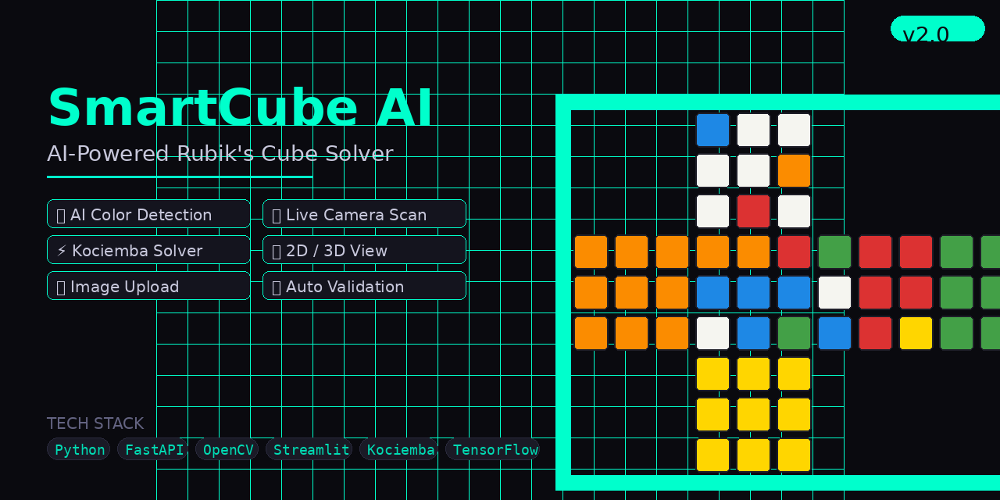
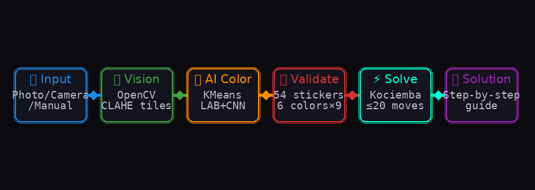
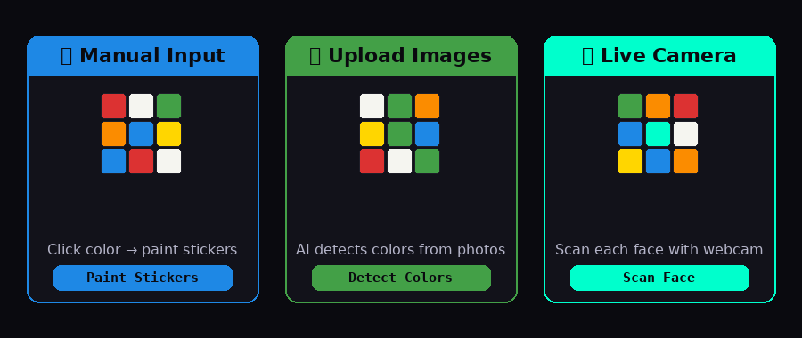

# 🧊 SmartCube AI



### AI-Powered Rubik's Cube Solver · Computer Vision · Kociemba Algorithm


---

SmartCube AI is a **full-stack AI project** that automatically scans, validates, and solves a Rubik's Cube from real images or live camera input. It combines **computer vision**, **machine learning**, **deep learning**, and the **Kociemba solving algorithm** to generate optimal step-by-step solutions in ≤ 20 moves.

---

## 🧠 How It Works



```
User Input  →  vision.py (OpenCV+CLAHE)  →  ai_color.py (KMeans+LAB)
           →  validator.py  →  solver.py (Kociemba ≤20 moves)  →  Streamlit UI
```

---

## 🎮 Input Modes



| Mode | Description |
|---|---|
| 🎨 **Manual Input** | Ruwix-style color palette — click to paint each sticker |
| 📁 **Image Upload** | Upload 6 face photos → AI auto-detects all colors |
| 📷 **Live Camera** | Capture each face live → instant AI color detection |

---

## 🚀 Features

| Feature | Details |
|---|---|
| **AI Color Detection** | KMeans + LAB colorspace (perceptually accurate) |
| **CNN Classifier** | Optional TensorFlow model for higher accuracy |
| **Kociemba Solver** | Optimal solution in ≤ 20 moves (HTM) |
| **Step Navigator** | Walk through solution move by move |
| **2D Net View** | Flat cross diagram of all 6 faces |
| **3D View** | Perspective matplotlib render |
| **Scramble** | Random 20-move scramble generator |
| **Validation** | Checks color counts, centers, solvability |

---

## 🗂️ Project Structure

```
SmartCube-AI/
├── backend/
│   ├── main.py          ← FastAPI app — 6 REST endpoints
│   ├── vision.py        ← Tile extraction + CLAHE lighting fix
│   ├── ai_color.py      ← KMeans + LAB color detection + CNN fallback
│   ├── solver.py        ← Kociemba solver wrapper
│   ├── validator.py     ← Cube state validation & auto-repair
│   ├── cube_logic.py    ← Full 3×3 move engine (F R U B L D + variants)
│   └── cube_visual.py   ← 2D net + 3D matplotlib visualizations
├── frontend/
│   └── app.py           ← Streamlit UI (manual + upload + camera)
├── ml/
│   └── train_cnn.py     ← CNN training script
├── assets/              ← README images
└── requirements.txt
```

---

## ⚙️ Setup & Run

```bash
git clone https://github.com/Subham8260/SmartCube-AI.git
cd SmartCube-AI
pip install -r requirements.txt

# Terminal 1 — Backend
cd backend && uvicorn main:app --port 9000 --reload

# Terminal 2 — Frontend
cd frontend && streamlit run app.py
```
Open **http://localhost:8501** ✅

---

## 📡 API Endpoints

| Method | Endpoint | Description |
|---|---|---|
| `GET` | `/health` | Health check |
| `POST` | `/scan-all` | Scan 1–6 base64 face images |
| `POST` | `/scan-frame` | Scan a single live camera frame |
| `POST` | `/solve` | Validate + solve the cube |
| `POST` | `/scramble` | Generate a random scramble |
| `POST` | `/apply-moves` | Apply moves to a cube state |

---

## 🤖 AI Components

| Component | Type | Purpose |
|---|---|---|
| CLAHE | Image Processing | Normalize lighting in photos |
| KMeans | Unsupervised ML | Find dominant tile color |
| LAB Distance | Color Science | Perceptually accurate color matching |
| CNN (3 Conv layers) | Deep Learning | High-accuracy color classification |
| Kociemba | Algorithm | Optimal cube solving ≤ 20 moves |

---

## 🔮 Future Enhancements
- [ ] Real-time video scanning
- [ ] Docker deployment
- [ ] Mobile app integration
- [ ] Cloud deployment (AWS / GCP)
- [ ] Support for 2×2 and 4×4 cubes

---

## 👨‍💻 Author

**Subham Dash** — B.Tech CSE | AI & ML Enthusiast

[](https://github.com/Subham8260)

⭐ **If you find this project useful, give it a star!**
